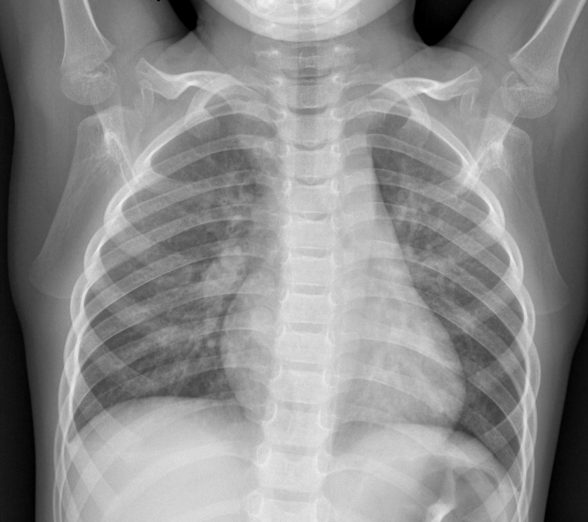

<div id="top"></div>
<!--
      The X-ray Pneumonia Project
-->

[![LinkedIn][linkedin-shield]][https://www.linkedin.com/in/lorenzo-pasquier-flaud-277672136/]


<!-- PROJECT LOGO -->
<br />
<div align="center">
  <a href="https://github.com/github_username/repo_name">
    
  </a>

<h3 align="center">X ray recognition</h3>

  <p align="center">
    X ray recognition is a Python project, the purpose is to recognize with x-ray picture of lungs if a patient could present a risk of Pneumonia. I developed a Machine learning model trained with many pictures to predict if a patient has pneumonia symptoms.
  </p>
</div>

<!-- TABLE OF CONTENTS -->
<details>
  <summary>Table of Contents</summary>
  <ol>
    <li>
      <a href="#about-the-project">About The Project</a>
      <ul>
        <li><a href="#built-with">Built With</a></li>
      </ul>
    </li>
    <li>
      <a href="#getting-started">Getting Started</a>
      <ul>
        <li><a href="#prerequisites">Prerequisites</a></li>
      </ul>
    </li>
    <li><a href="#usage">Usage</a></li>
  </ol>
</details>


<!-- ABOUT THE PROJECT -->
## About The Project

[![Product Name Screen Shot][product-screenshot]](https://example.com)

I did this project during two weeks in school. I chose this topic because it was during the COVID period (1st Lockdown) and I found the idea really innovative and useful to predict if a patient could be detected as sick or not just with X-ray picture and Datascience. The predictions are based on a great numbers of pictures, the Machine Learning model is trained and evaluated with clusters of pictures. Here the Illness is Pneumonia, so the X-ray pictures are only based on lungs.

<p align="right">(<a href="#top">back to top</a>)</p>

### Built With

* [Python 3.10](https://docs.python.org/3/)
* [pandas](https://pandas.pydata.org/docs/)
* [numpy](https://numpy.org/doc/)
* [matplotlib](https://matplotlib.org/stable/users/index.html)
* [seaborn](https://seaborn.pydata.org/)
* [callbacks](https://keras.io/api/callbacks/)
* [tensorflow](https://www.tensorflow.org/resources/models-datasets)

<p align="right">(<a href="#top">back to top</a>)</p>


<!-- GETTING STARTED -->
## Getting Started

To get started with this project, first install Python Version 3.10
You will also need to install 'pip' ,  to install all the project dependencies

### Prerequisites

This is all the dependencies you need to install with pip
* pip
  ```sh
  pip install pandas
  pip install numpy
  pip install matplotlib
  pip install seaborn
  pip install callbacks
  pip install tensorflow
  ```

<!-- USAGE EXAMPLES -->
## Usage

To use the project and run the file x-ray.ipynb (Jupiter Notebook) you need a special environment who can read jupyter Notebooks.
I advise Anaconda (https://docs.anaconda.com/)

<p align="right">(<a href="#top">back to top</a>)</p>